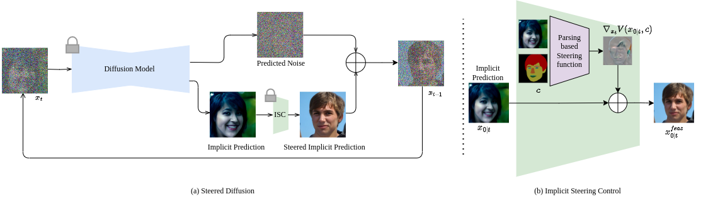
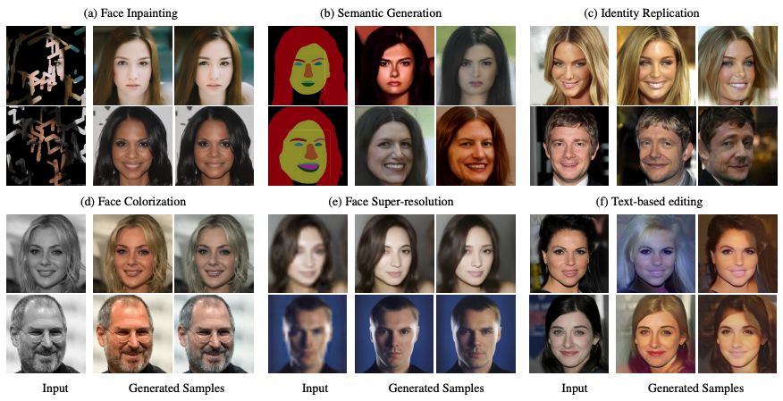

<!--
Copyright (C) 2023-2024 Mitsubishi Electric Research Laboratories (MERL)

SPDX-License-Identifier: AGPL-3.0-or-later
-->

# Steered Diffusion (ICCV 2023)


This repository contains the implementation of the paper:
> **Steered Diffusion: A Generalized Framework for Plug-and-Play Conditional Face Synthesis**<br>
> [Nithin Gopalakrishnan Nair](https://nithin-gk.github.io/), [Anoop Cherian](https://www.merl.com/people/cherian), [Suhas Lohit](https://suhaslohit.github.io),[Ye Wang](https://www.merl.com/people/yewang), [Toshiaki Koike-Akino](https://www.merl.com/people/koike), [Vishal M Patel](https://engineering.jhu.edu/vpatel36/vishal-patel), [Tim K Marks](https://www.merl.com/people/tmarks)

IEEE/CVF International Conference on Computer Vision (**ICCV**), 2023

From [Mitsubishi Electric Research Labs](https://www.merl.com/) and [VIU Lab](https://engineering.jhu.edu/vpatel36/), Johns Hopkins University


[[Paper](https://openaccess.thecvf.com/content/ICCV2023/html/Nair_Steered_Diffusion_A_Generalized_Framework_for_Plug-and-Play_Conditional_Image_Synthesis_ICCV_2023_paper.html)] |
[[Project Page](https://www.merl.com/demos/steered-diffusion)]

Keywords: Zero Shot Generation, Conditional Face Generation, Multimodal Face generation, Text to image generation, Diffusion based Face Generation

## Summary



We propose **Steered Diffusion**, where users can perform zero shot conditional generation using conditional generation.
    *(a) Linear Inverse Problems*. Can generate clean images linear conditions like Super resolution, Colorization and Inpainting .
    *(b) Complex Network based conditioning*. Users can give generic conditions like segmentation maps, identity image and text based generation.

### Contributions:

- We propose steered diffusion, a general plug-and-play framework that can utilize various pre-existing models to steer an unconditional diffusion model.
- We present the first work applicable for both label-level synthesis and image-to-image translation tasks, and we demonstrate its effectiveness for various applications.
- We propose an implicit conditioning-based sampling strategy that significantly boosts the performance of conditional sampling from the unconditional diffusion models compared to previous methods.
- We introduce a new strategy that utilizes multiple steps of projected gradient descent to improve sample quality.
<p align="center">
  
</p>

## Environment setup


```
conda env create -f environment.yml
```


## Pretrained models:

Please download the pretrained models using
```
python utils/download_models.py
```


# Testing on custom datasets

## Data Preparation
You can test on any custom datasets by arranding the data in the following format. Please note that you can choose to give either one or more modalities
```
    ├── data
    |   ├── images
    |   └── masks
```

## Testing code on images
For testing purposes, for simplicity, the code expects a clean RGB image as input for the variable --img_path mentioned below. The degraded image is extracted from the input by the code based on the condition being tested. Please modify the code as needed to inpout a degraded image directly. Also note that, for inpainting, a separate mask file needs to be provided.
For testing the conditions:
```
grayscale: converts a grayscale image to an RGB image
SR: super-resolution
inpaint
Identity: generates new images with the same identity as the given image
Semantics: generated new images with the same semantic face parsing map as the given image
```
please use the command
```
python steered_generate.py --config configs/diffusion_config.yml --img_path /path/to/image --mask_path /path/to/mask --condition "your condition"
```
For testing image editing, please use the command
```
python steered_generate.py --config configs/diffusion_config.yml --img_path /path/to/image --mask_path /path/to/mask --condition "editing" --editing_text " the text prompt to add to image"

```
The final output image will be saved in the results directory in the format "condition image|generated sample"
## Testing code on datasets

Test on custom dataset using:
```
python steered_generate_dataset.py --data_fold /path/to/data --condition "your condition" --config configs/diffusion_config.yml
```

Please set the flags you need for the generation.


## Testing dataset

We performed experiments on the first 300 images of CelebA-Multimodal dataset. These can be downloaded from
```
https://github.com/IIGROUP/MM-CelebA-HQ-Dataset
```

## Citation
If you use our work, please use the following citation

```bibTex
@inproceedings{nair2023steered,
  title={Steered Diffusion: A Generalized Framework for Plug-and-Play Conditional Image Synthesis},
  author={Nair, Nithin Gopalakrishnan and Cherian, Anoop and Lohit, Suhas and Wang, Ye and Koike-Akino, Toshiaki and Patel, Vishal M and Marks, Tim K},
  booktitle={Proceedings of the IEEE/CVF International Conference on Computer Vision},
  pages={20850--20860},
  year={2023}
}
```

## Contributing

See [CONTRIBUTING.md](CONTRIBUTING.md) for our policy on contributions.

## License

Released under `AGPL-3.0-or-later` license, as found in the [LICENSE.md](LICENSE.md) file.

All files, except as noted below:
```
Copyright (c) 2023-2024 Mitsubishi Electric Research Laboratories (MERL)

SPDX-License-Identifier: AGPL-3.0-or-later
```

The following files:

* `guided_diffusion/guided_diffusion/__init__.py`,`guided_diffusion/guided_diffusion/fp16_util.py`
* `guided_diffusion/guided_diffusion/logger.py`,`guided_diffusion/guided_diffusion/nn.py`
* `guided_diffusion/guided_diffusion/respace.py`,`guided_diffusion/guided_diffusion/script_util.py`
* `guided_diffusion/guided_diffusion/unet.py`

were taken without modification from https://github.com/openai/guided-diffusion (license included in [LICENSES/MIT.txt](LICENSES/MIT.txt)):

```
Copyright (c) 2021 OpenAI
```

The following files:

* `losses/ssim.py`

were taken without modification from https://github.com/Po-Hsun-Su/pytorch-ssim/tree/master (license included in [LICENSES/MIT.txt](LICENSES/MIT.txt)):

```
Copyright (c) 2021 Po-Hsun-Su
```

The following files:

* `guided_diffusion/guided_diffusion/interp_methods.py`

were taken without modification from https://github.com/assafshocher/ResizeRight/blob/master/interp_methods.py (license included in [LICENSES/MIT.txt](LICENSES/MIT.txt)):

```
Copyright (c) 2020 Assaf Shocher
```

The following files

* `guided_diffusion/guided_diffusion/resize_right.py`

were adapted from https://github.com/assafshocher/ResizeRight/blob/master/resize_right.py (license included in [LICENSES/MIT.txt](LICENSES/MIT.txt)):

```
Copyright (c) 2023-2024 Mitsubishi Electric Research Laboratories (MERL)
Copyright (c) 2020 Assaf Shocher
```

The following files
* `guided_diffusion/guided_diffusion/gaussian_diffusion.py`

were adapted from https://github.com/openai/guided-diffusion (license included in [LICENSES/MIT.txt](LICENSES/MIT.txt)):

```
Copyright (c) 2023-2024 Mitsubishi Electric Research Laboratories (MERL)
Copyright (c) 2021 OpenAI
```

The following files
* `steered_diffusion.py`,`steered_diffusion_dataset.py`,`parser.py`

were adapted from https://github.com/omriav/blended-diffusion (license included in [LICENSES/MIT.txt](LICENSES/MIT.txt)):

```
Copyright (c) 2023-2024 Mitsubishi Electric Research Laboratories (MERL)
Copyright (C) 2022-2023 Omri Avrahami
```

The following files
* `utils/download_models.py`,`utils/download_models_func.py`

were adapted from https://github.com/Nithin-GK/UniteandConquer/blob/main/download_models.py  (license included in [LICENSES/Apache-2.0.txt](LICENSES/Apache-2.0.txt)):

```
# Copyright (C) 2022-2023 Nithin Gopalakrishnan Nair
```
